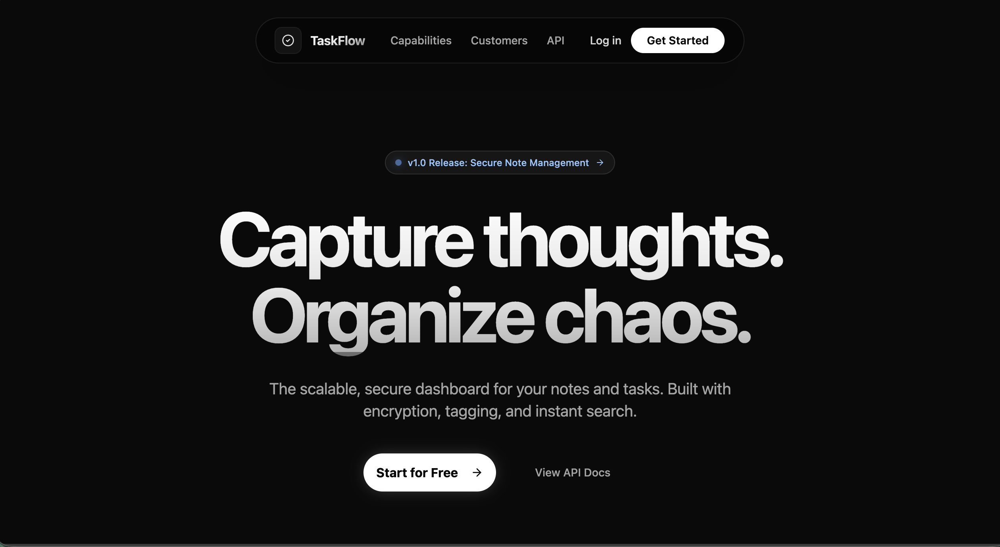
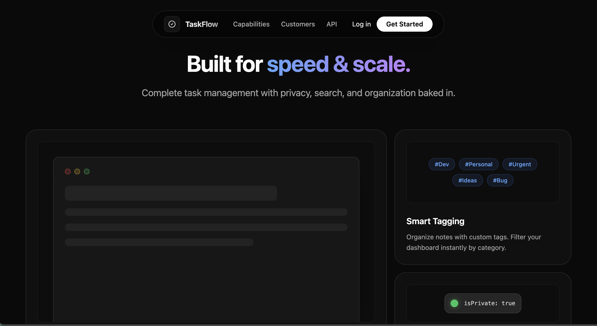
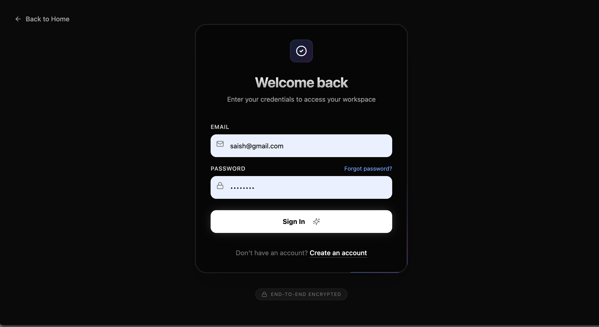
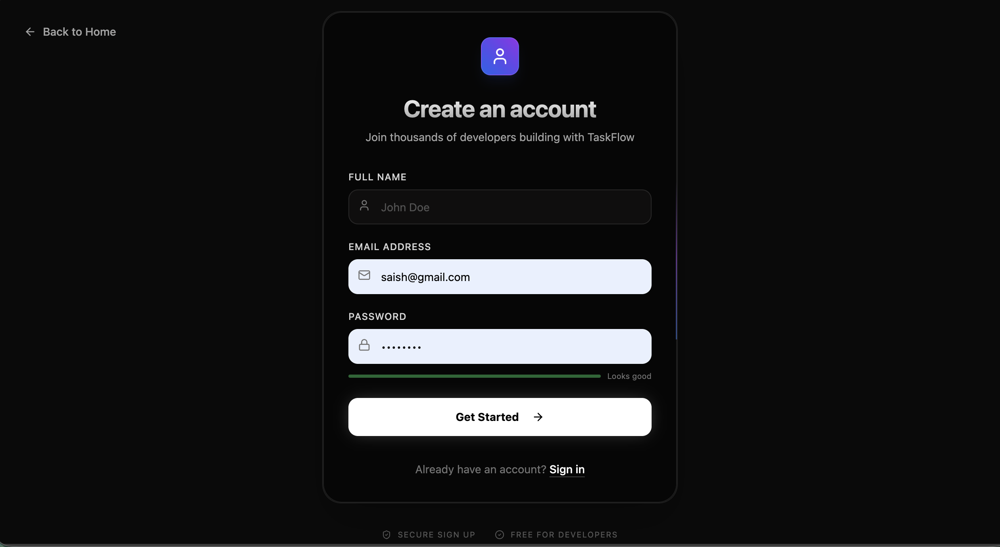
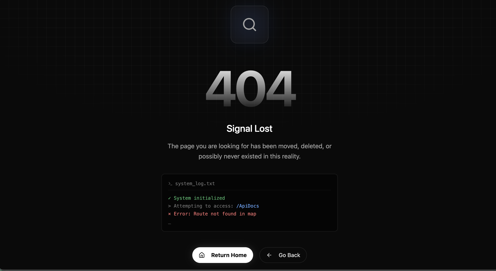
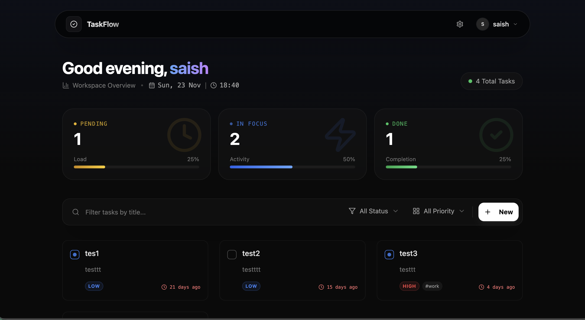
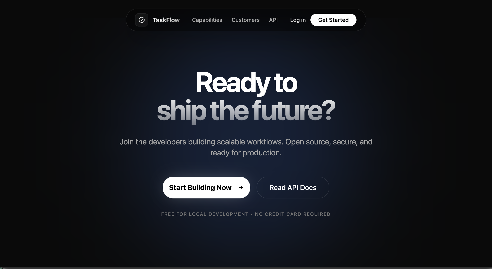
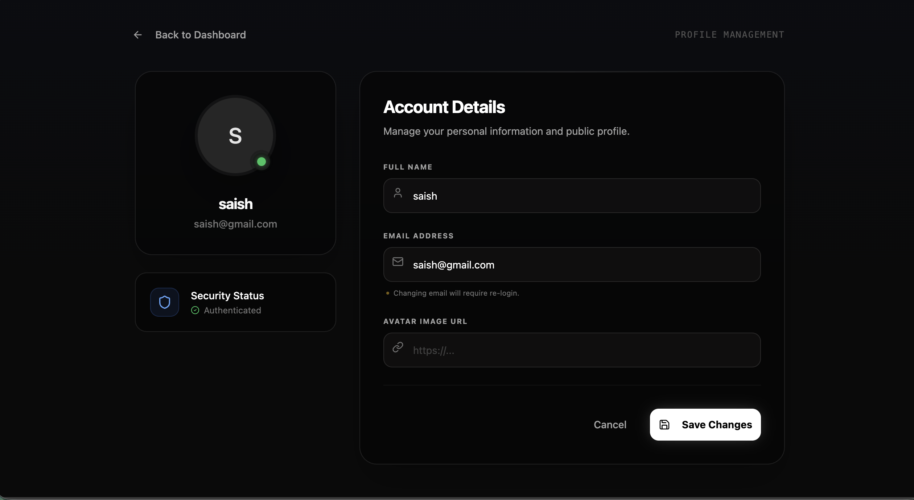
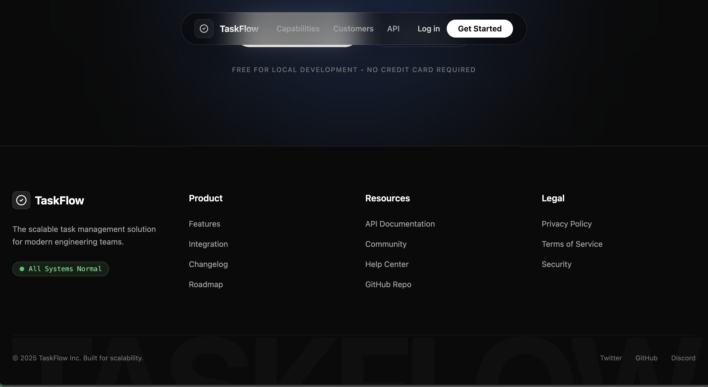
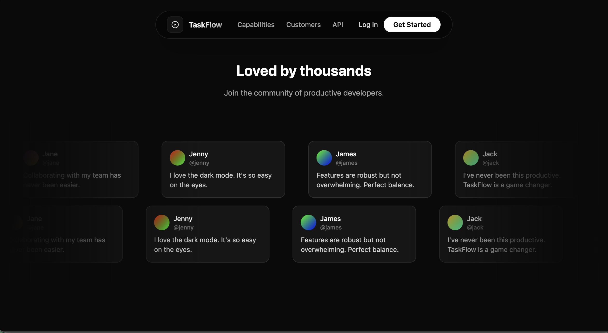

# TaskFlow

<p align="center">
  <a href="https://www.google.com/search?q=%23"></a>
  <a href="https://www.google.com/search?q=/frontend/src/pages/ApiDocs.tsx"></a>
  <a href="#"></a>
  <a href="#"></a>
</p>

---

> **TaskFlow** — a premium, production-ready task management interface built with a focus on performance, accessibility, and delightful UX. Inspired by modern tools like Linear and Vercel.

---

## Table of Contents

- [About](#about)
- [Demo & Screenshots](#demo--screenshots)
- [Features](#features)
- [Architecture & Scalability](#architecture--scalability)
- [Tech Stack](#tech-stack)
- [Getting Started](#getting-started)
- [Folder Structure](#folder-structure)
- [API Endpoints](#api-endpoints)
- [CI / CD & Deployment](#ci--cd--deployment)
- [Contributing](#contributing)
- [License](#license)
- [Acknowledgements](#acknowledgements)

---

## About

TaskFlow is a minimalist, glassmorphic task manager with advanced UX patterns: optimistic updates, real-time HUD, contextual task cards, and enterprise-grade authentication. Designed for developer assessments and production prototypes.

---

## Demo & Screenshots

> Replace the screenshot paths with the hosted images in `frontend/public` or your CDN when publishing.

<details>
<summary><strong>Click to expand screenshots</strong></summary>

### Landing & Auth

|                            Hero                             |                          Hero (alt)                           |
| :---------------------------------------------------------: | :-----------------------------------------------------------: |
|  |  |

|                             Login                             |                             Signup                              |
| :-----------------------------------------------------------: | :-------------------------------------------------------------: |
|  |  |

|                         404 Not Found                          |
| :------------------------------------------------------------: |
|  |

### Dashboard & Profile

|                               Dashboard                               |                                Ready Section                                 |
| :-------------------------------------------------------------------: | :--------------------------------------------------------------------------: |
|  |  |

|                              Profile                              |                             Footer                              |
| :---------------------------------------------------------------: | :-------------------------------------------------------------: |
|  |  |

|                                Testimonial                                |                                      Extra Screenshot                                       |
| :-----------------------------------------------------------------------: | :-----------------------------------------------------------------------------------------: |
|  |  |

</details>

---

## Features

- Glassmorphic, dark-first UI with smooth Framer Motion animations.
- JWT-based authentication with HttpOnly cookies & CSRF protections.
- Optimistic UI updates for instant task interaction feedback.
- Filter & search (status, priority) performed client-side with minimal latency.
- Accessible forms (React Hook Form + Zod) with inline validation.
- Modular component architecture (Radix UI primitives + Lucide icons).
- Scalable by design — CDN distribution, code splitting, and index-friendly DB queries.

---

## Architecture & Scalability

**Frontend**

- Vite for lightning-fast dev server and optimized production builds.
- Route-level code splitting with `React.lazy()` and `Suspense`.
- Tailwind CSS for utility-first responsive styling.

**Backend**

- Node + Express with stateless JWT authentication for horizontal scaling.
- MongoDB with indexes on `user_id`, `status`, `priority` for performant queries.
- Rate limiting and basic WAF-type protections at the application edge.

**CI/CD**

- Husky pre-commit checks (lint + tests).
- Dockerfile and example workflows for consistent deployments.

---

## Tech Stack

**Frontend**

- React 18, Vite, TypeScript
- Tailwind CSS, Framer Motion, React Hook Form, Zod
- Radix UI, Lucide Icons, Zustand (or Context API)

**Backend**

- Node.js, Express.js
- MongoDB (Mongoose)
- Helmet, CORS, bcrypt, jsonwebtoken

---

## Getting Started

> The project uses separate `backend` and `frontend` folders.

### Prerequisites

- Node.js v16 or newer
- MongoDB (local or Atlas)

### Local Setup (quick)

```bash
# clone
git clone https://github.com/yourusername/taskflow.git
cd taskflow

# backend
cd backend
npm install
cp .env.example .env
# set MONGO_URI and JWT_SECRET in .env
npm run dev
```

Open a new terminal for frontend:

```bash
cd frontend
npm install
npm run dev
```

Visit:

- Frontend: `http://localhost:5173`
- API: `http://localhost:5000`

---

## Folder Structure (recommended)

```
taskflow/
├─ backend/
│  ├─ src/
│  │  ├─ controllers/
│  │  ├─ middleware/
│  │  ├─ models/
│  │  └─ routes/
│  └─ Dockerfile
├─ frontend/
│  ├─ public/
│  ├─ src/
│  │  ├─ components/
│  │  ├─ hooks/
│  │  ├─ pages/
│  │  └─ styles/
│  └─ vite.config.ts
└─ README.md
```

---

## API Endpoints (representative)

- `POST /api/auth/register` — Create user
- `POST /api/auth/login` — Login & set HttpOnly cookie
- `GET /api/tasks` — Get tasks (supports query: `?status=pending&priority=high`)
- `POST /api/tasks` — Create task
- `PUT /api/tasks/:id` — Update task
- `DELETE /api/tasks/:id` — Delete task

---

## CI / CD & Deployment

- Use automated workflows on GitHub Actions or GitLab CI.
- Build frontend: `npm run build` (inside frontend)
- Build Docker images for consistent environment parity.
- Host static assets on a CDN, host backend on a scalable platform (e.g., Heroku, DigitalOcean App Platform, Vercel, or AWS ECS).

---

## Contributing

We welcome PRs and improvements. Please follow the standard workflow:

1. Fork the repo
2. Create a feature branch: `git checkout -b feat/something`
3. Run tests & lint: `npm run lint`
4. Open a PR with a descriptive title and changes

---

## License

This project is licensed under the MIT License — see the [LICENSE](LICENSE) file for details.

---

## Acknowledgements

Built with ❤️ — inspired by community patterns from Vercel, Linear, and the shadcn/ui ecosystem.
